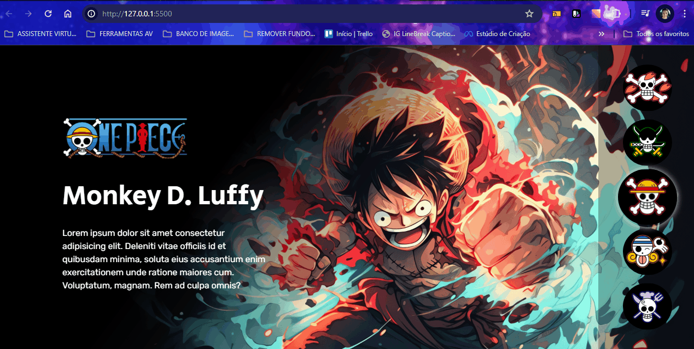

# Projeto One Piece

Um projeto do site dos personagens do One Piece contendo logotipo, nome, descrição e desenho grande do personagem na parte principal. Menu clicável a esquerda com caveiras correspondentes a cada personagem para serem selecionados pelo usuário. Para telas de desktops, tablets e celulares 📲💻

## Tecnologias utilizadas
- HTML
- CSS
- JAVASCRIPT

## 📂 Acesso ao projeto

Você pode acessar o código fonte do projeto 

<https://github.com/denisero19/one-piece>